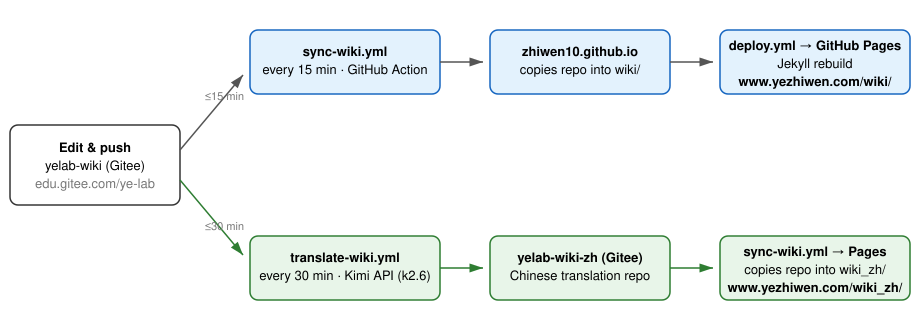

# How this website works

This repo is the **authoritative source** of the lab wiki. Everything else — the public website and the Chinese translation — is generated from here automatically.

**Sites**

- English: **https://www.yezhiwen.com/wiki/**
- 中文: **https://www.yezhiwen.com/wiki_zh/** — translated from this repo, lives at [yelab-wiki-zh](https://gitee.com/ye-lab/yelab-wiki-zh)
- Both are excluded from search engines (`robots.txt` + `noindex` meta).

**Editing**

- Make all content edits here, in English, and push to `main`. The English site updates within ~15 minutes.
- To add a page: create the `.md` file and add a matching entry to `sidebar.md`, keeping the same order as this README.
- Never edit `wiki/` or `wiki_zh/` in the website repo by hand — the sync overwrites them.

**Publishing** (`.github/workflows/sync-wiki.yml` in [zhiwen10.github.io](https://github.com/zhiwen10/zhiwen10.github.io))

Every 15 minutes a GitHub Action clones this repo into the site's `wiki/` folder and the Chinese repo into `wiki_zh/`, commits any changes, and triggers the Jekyll rebuild that publishes to GitHub Pages.

**Translation** (`.github/workflows/translate-wiki.yml`)

Every 30 minutes a second Action diffs this repo against the last-synced commit (recorded in `.translation-sync` on both sides), translates new and changed pages into Chinese with the Kimi API (`kimi-k2.6`), mirrors deletions, and pushes to [yelab-wiki-zh](https://gitee.com/ye-lab/yelab-wiki-zh) — the publishing pipeline then carries it to `/wiki_zh/`. End to end, an English edit reaches the Chinese site within ~45 minutes. Both workflows can also be run manually from the website repo's Actions tab.

Translations are machine-generated: skim the `Auto-translate` commit diffs when convenient and fix mistakes directly in the zh repo (a fix persists until that English page changes again).
